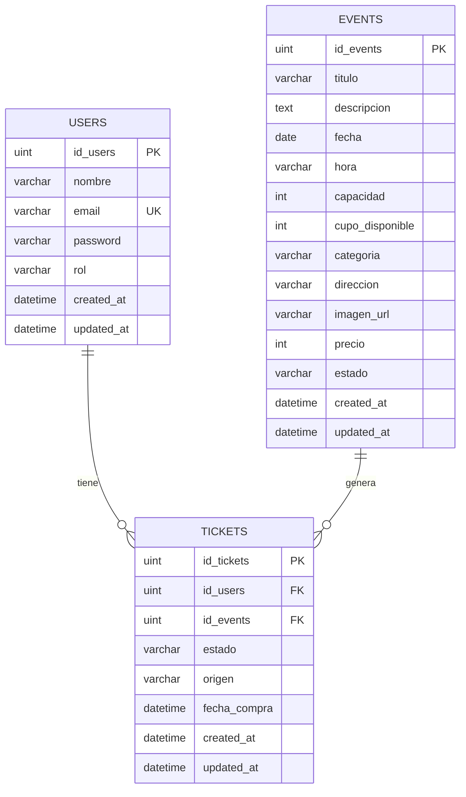

# TicketApp — Sistema de Gestión de Entradas

Sistema web de compra y gestión de entradas para eventos. Permite a los usuarios explorar el catálogo de eventos disponibles, comprar entradas, cancelarlas y transferirlas a otros usuarios registrados. Los administradores pueden gestionar el catálogo completo de eventos y ver reportes de ocupación. Desarrollado como proyecto universitario para la materia **Desarrollo de Software — UCC 2026**.

---

## Tabla de Contenidos

- [Capturas de Pantalla](#capturas-de-pantalla)
- [Tecnologías Utilizadas](#tecnologías-utilizadas)
- [Requisitos Previos](#requisitos-previos)
- [Instalación y Uso](#instalación-y-uso)
- [Primer Administrador](#primer-administrador)
- [Comandos de Tests](#comandos-de-tests)
- [Endpoints de la API](#endpoints-de-la-api)
- [Bonus Track — Sorteo por evento](#bonus-track--sorteo-por-evento)
- [Diagrama de Base de Datos](#diagrama-de-base-de-datos)
- [Decisiones de Diseño](#decisiones-de-diseño)

---

## Capturas de Pantalla

### Catálogo de Eventos


### Detalle de Evento


### Mis Entradas


### Panel de Administración


### Login


---

## Tecnologías Utilizadas

| Capa          | Tecnología                                      |
|---------------|-------------------------------------------------|
| Backend       | Go 1.22 + Gin (framework HTTP)                  |
| ORM           | GORM (mapeo objeto-relacional)                  |
| Base de datos | MySQL 8                                         |
| Autenticación | JWT (`github.com/golang-jwt/jwt/v5`) + SHA-256  |
| Frontend      | React 18 + Vite + React Router v6               |
| HTTP Client   | Axios                                           |
| Testing       | Go `testing` + `testify` + `net/http/httptest`  |

---

## Requisitos Previos

Tener instalados antes de comenzar:

- **Go** 1.22 o superior → https://go.dev/dl/
- **Node.js** 20 o superior → https://nodejs.org/
- **MySQL** 8 corriendo localmente

Verificar instalaciones:

```bash
go version
node --version
mysql --version
```

---

## Instalación y Uso

### 1. Clonar el repositorio

```bash
git clone https://github.com/AguAlbizu/ProyectoTicketet.git
cd ProyectoTicketet
```

### 2. Crear la base de datos

```bash
mysql -uroot -p
```

```sql
CREATE DATABASE ticketapp CHARACTER SET utf8mb4 COLLATE utf8mb4_unicode_ci;
EXIT;
```

Opcionalmente, cargar datos de ejemplo:

```bash
mysql -uroot -p ticketapp < database/seed.sql
```

### 3. Configurar el backend

```bash
cd backend
cp .env.example .env
```

Editar `backend/.env` con los datos de conexión:

```
DB_HOST=localhost
DB_PORT=3306
DB_USER=root
DB_PASSWORD=tu_password
DB_NAME=ticketapp
JWT_SECRET=un_secreto_seguro
JWT_EXPIRATION_HOURS=24
PORT=8080
```

### 4. Levantar el backend

```bash
cd backend
go run main.go
```

El servidor queda disponible en `http://localhost:8080`.  
Las tablas y claves foráneas se crean automáticamente al iniciar.

### 5. Levantar el frontend

En una nueva terminal:

```bash
cd frontend
npm install
npm run dev
```

El frontend queda disponible en `http://localhost:5173`.

### Orden recomendado para levantar el proyecto

1. Iniciar MySQL
2. Correr el backend (`go run main.go`)
3. Correr el frontend (`npm run dev`)
4. Abrir `http://localhost:5173`

---

## Primer Administrador

El sistema no incluye un administrador por defecto. Para crear el primero, ejecutar el siguiente SQL **una sola vez** contra la base de datos (contraseña: `admin123`):

```sql
INSERT INTO users (nombre, email, password, rol, created_at, updated_at)
VALUES (
  'Admin',
  'admin@ticketapp.com',
  '240be518fabd2724ddb6f04eeb1da5967448d7e831c08c8fa822809f74c720a9',
  'administrador',
  NOW(),
  NOW()
);
```

Luego iniciar sesión con `admin@ticketapp.com` / `admin123`. A partir de ahí, desde el **Panel Admin → Crear Admin** se pueden crear nuevos administradores o promover usuarios existentes sin necesidad de tocar la base de datos.

---

## Comandos de Tests

Todos los comandos se ejecutan desde la carpeta `backend/`.

```bash
cd backend
```

**Correr todos los tests:**
```bash
go test ./tests/...
```

**Correr con detalle (ver cada test):**
```bash
go test ./tests/... -v
```

**Ver porcentaje de cobertura:**
```bash
go test ./tests/... -coverpkg=ticketapp/services,ticketapp/utils,ticketapp/controllers -cover
```

**Ver cobertura función por función:**
```bash
go test ./tests/... -coverpkg=ticketapp/services,ticketapp/utils,ticketapp/controllers -coverprofile=coverage.out
go tool cover -func=coverage.out
```

**Con Makefile:**
```bash
make test      # todos los tests con detalle
make coverage  # cobertura función por función
```

Cobertura actual: **52.4%** sobre servicios, utils y controladores (65 tests). El módulo de
administrador (`admin_controller.go`, `admin_event_service.go`) todavía no tiene tests propios —
es el próximo paso para llegar al 80% exigido en la entrega final.

---

## Endpoints de la API

### Públicos (sin autenticación)

| Método | Ruta | Descripción |
|--------|------|-------------|
| POST | `/api/auth/register` | Registrar nuevo usuario |
| POST | `/api/auth/login` | Iniciar sesión, retorna JWT |
| GET | `/api/events` | Listar eventos activos (filtro por `?categoria=`) |
| GET | `/api/events/:id` | Detalle de un evento |

### Cliente (requiere JWT)

| Método | Ruta | Descripción |
|--------|------|-------------|
| POST | `/api/tickets` | Comprar entrada para un evento |
| GET | `/api/tickets/my-tickets` | Ver mis entradas |
| DELETE | `/api/tickets/:id` | Cancelar una entrada propia |
| PUT | `/api/tickets/:id/transfer` | Transferir entrada a otro usuario |

### Administrador (requiere JWT con rol `administrador`)

| Método | Ruta | Descripción |
|--------|------|-------------|
| GET | `/api/admin/events` | Listar todos los eventos (activos y cancelados) |
| POST | `/api/admin/events` | Crear nuevo evento |
| PUT | `/api/admin/events/:id` | Editar evento (incluye cambio de estado) |
| DELETE | `/api/admin/events/:id` | Cancelar evento y sus entradas activas |
| GET | `/api/admin/events/:id/report` | Reporte de ocupación y compradores |
| POST | `/api/admin/users` | Crear nuevo usuario administrador |
| PUT | `/api/admin/users/promote` | Promover usuario existente a administrador |

---

## Bonus Track — Sorteo por evento

Cada evento puede tener un **sorteo** opcional asociado (nombre + valor por chance). Cualquier
cliente que tenga una entrada activa para ese evento puede comprar una o más **chances** (a más
chances, más probabilidades de ganar), tanto desde el detalle del evento como desde "Mis
Entradas". Un administrador ejecuta el sorteo desde su panel: se elige un ganador al azar entre
todas las chances cargadas y se notifica por email a **todos** los participantes — al ganador con
un mensaje de felicitación, y al resto avisando el resultado.

**Backend:** `domain/sorteo.go`, `domain/chance.go`, `dao/sorteo_dao.go`, `dao/chance_dao.go`,
`services/sorteo_service.go`, `controllers/sorteo_controller.go`.

| Método | Ruta | Auth | Descripción |
|--------|------|------|-------------|
| GET | `/api/events/:id/sorteo` | No | Obtener el sorteo de un evento (si tiene uno cargado) |
| POST | `/api/sorteos/:id/chances` | JWT | Comprar `cantidad` chances (requiere entrada activa para el evento) |
| GET | `/api/sorteos/:id/my-chances` | JWT | Cantidad de chances propias en un sorteo |
| POST | `/api/admin/events/:id/sorteo` | JWT (administrador) | Crear el sorteo de un evento |
| GET | `/api/admin/sorteos` | JWT (administrador) | Listar sorteos con su evento, para el panel admin |
| POST | `/api/admin/sorteos/:id/draw` | JWT (administrador) | Ejecutar el sorteo y notificar por email |

Las rutas `/api/admin/*` usan `middleware.RequireRole("administrador")`, que se apoya en el
campo `role` que `AuthMiddleware` inyecta en el contexto a partir del JWT.

**Frontend:** `api/sorteosApi.js`, `components/sorteos/SorteoPanel.jsx` (se muestra tanto en el
detalle del evento como en cada ticket activo de "Mis Entradas").

**Notificación por email:** usa el `EmailClient` (interfaz en `clients/email_client.go`). Si no
hay `EMAIL_API_URL` configurado, el sistema usa `NoOpEmailClient` automáticamente y el sorteo
funciona igual, solo que sin enviar los correos (pensado para desarrollo local sin proveedor de
email configurado).

---

## Diagrama de Base de Datos

El diagrama fuente se encuentra en [`docs/db-diagram.md`](docs/db-diagram.md).



**Claves foráneas implementadas:**
- `tickets.id_users` → `users.id_users` (ON DELETE RESTRICT, ON UPDATE CASCADE)
- `tickets.id_events` → `events.id_events` (ON DELETE RESTRICT, ON UPDATE CASCADE)

---

## Decisiones de Diseño

### 1. Arquitectura en capas estricta (domain → dao → service → controller)

Se optó por separar claramente las responsabilidades en cuatro capas. El `domain` define las estructuras de datos, el `dao` maneja la persistencia, el `service` contiene la lógica de negocio y el `controller` traduce entre HTTP y el servicio. Esta separación permite testear los servicios de forma independiente usando mocks sin necesidad de base de datos real, lo que se refleja en la suite de tests unitarios del proyecto.

### 2. Raw SQL para operaciones de actualización en lugar de GORM Save

Al usar `db.Save()` de GORM para actualizar registros, el ORM sobreescribe todos los campos incluyendo `created_at`, lo que generaba errores con el modo estricto de MySQL (fechas cero `0000-00-00`). Se optó por `db.Exec()` con SQL explícito en los métodos de actualización, actualizando únicamente los campos necesarios. Esto evita el problema de las fechas y hace las actualizaciones más eficientes.

### 3. Campo `origen` en tickets para distinguir compras de transferencias

En lugar de mantener una tabla separada para transferencias, se agregó el campo `origen` (`compra` / `transferencia`) al modelo `Ticket`. Cuando un usuario transfiere una entrada, el ticket original pasa a estado `transferido` y se crea un nuevo ticket para el destinatario con `origen = transferencia`. Esto simplifica el modelo de datos y permite a la vista "Mis Entradas" separar los tickets en categorías: disponibles, compradas, recibidas y canceladas.

### 4. JWT stateless con claims de rol embebidos

El token JWT incluye `user_id`, `role` y `email` directamente en el payload. Esto evita una consulta a la base de datos en cada request protegido — el middleware solo valida la firma y extrae los claims. La autorización por rol se implementa con un middleware separado `RequireRole()` encadenado al de autenticación, lo que permite proteger grupos de rutas de forma declarativa en el router sin lógica de permisos dispersa en los controladores.

### 5. Cancelación en cascada al cancelar un evento

Cuando un administrador cancela un evento, el sistema cancela automáticamente todas las entradas activas asociadas antes de marcar el evento como cancelado. Si el evento se reactiva posteriormente mediante edición, el cupo se restablece a la capacidad completa (ya que todos los tickets fueron cancelados), permitiendo que nuevos compradores adquieran entradas sin inconsistencias en el stock disponible.
