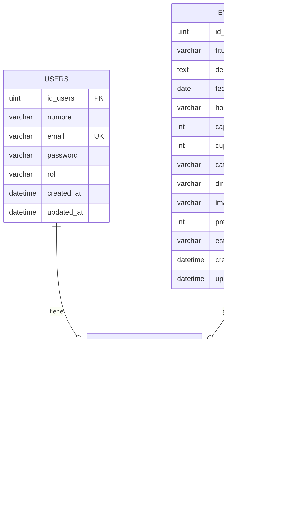

# Diagrama de Base de Datos — TicketApp

```mermaid
erDiagram
    USERS {
        uint id_users PK
        varchar nombre
        varchar email UK
        varchar password
        varchar rol
        datetime created_at
        datetime updated_at
    }

    EVENTS {
        uint id_events PK
        varchar titulo
        text descripcion
        date fecha
        varchar hora
        int capacidad
        int cupo_disponible
        varchar categoria
        varchar direccion
        varchar imagen_url
        int precio
        varchar estado
        datetime created_at
        datetime updated_at
    }

    TICKETS {
        uint id_tickets PK
        uint id_users FK
        uint id_events FK
        varchar estado
        varchar origen
        datetime fecha_compra
        datetime created_at
        datetime updated_at
    }

    USERS ||--o{ TICKETS : "tiene"
    EVENTS ||--o{ TICKETS : "genera"
```
