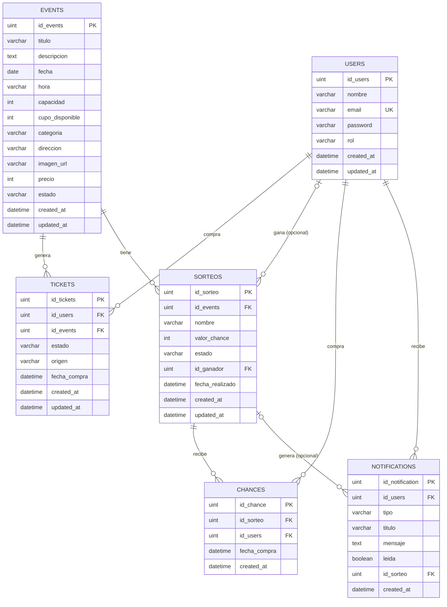

# Diagrama de Base de Datos — TicketApp

## Claves foráneas implementadas

| Tabla origen | Columna | Referencia | ON DELETE | ON UPDATE |
|---|---|---|---|---|
| `tickets` | `id_users` | `users.id_users` | RESTRICT | CASCADE |
| `tickets` | `id_events` | `events.id_events` | RESTRICT | CASCADE |
| `sorteos` | `id_events` | `events.id_events` | CASCADE | CASCADE |
| `sorteos` | `id_ganador` | `users.id_users` | SET NULL | CASCADE |
| `chances` | `id_sorteo` | `sorteos.id_sorteo` | CASCADE | CASCADE |
| `chances` | `id_users` | `users.id_users` | RESTRICT | CASCADE |
| `notifications` | `id_users` | `users.id_users` | CASCADE | CASCADE |
| `notifications` | `id_sorteo` | `sorteos.id_sorteo` | CASCADE | CASCADE |

`USERS`, `EVENTS` y `TICKETS` son las tres entidades principales requeridas por la consigna.
`SORTEOS`, `CHANCES` y `NOTIFICATIONS` son las entidades agregadas para el Bonus Track
(sorteo por evento y notificaciones in-app).
